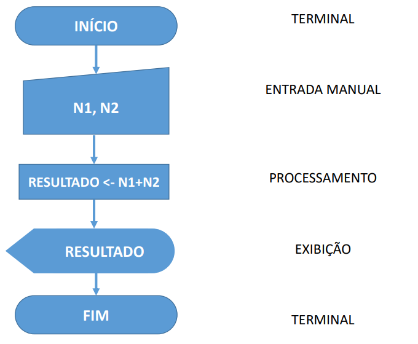
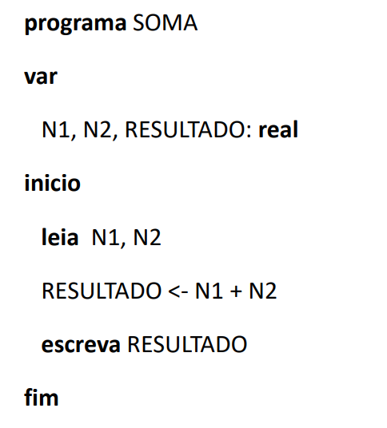

# App soma
Exercício do 4º bimestre, componente curricular de Informática. IBR (Boa Vista-RR).  Construa o diagrama de bloco para calcular e imprimir a soma de dois números inteiros fornecidos pelo usuário. Após isso, crie uma aplicação utilizando a ferramenta scratch 2.0.

## Diagrama de Blocos

## Português Estruturado  

por Dalmo S. Mendes  

## Referência:
MANZARO, José; LOURENÇO, André; MATOS, Ecivaldo. Algoritmos:  
Técnicas de Programação. São Paulo: Érica, 2015
